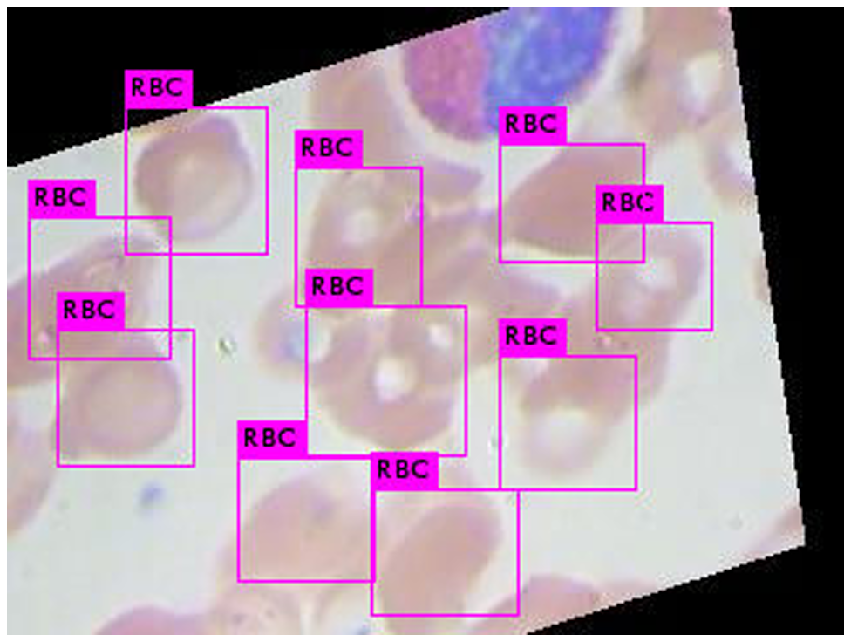

#Custom object training and detection with YOLOv3, Darknet and OpenCV<br>
https://blog.francium.tech/custom-object-training-and-detection-with-yolov3-darknet-and-opencv-41542f2ff44e<br>

https://medium.com/@duraklefkan/training-yolov3-object-detection-api-with-your-own-dataset-4dcfc7c1c34c

* The structure of the `BCCD_dataset`

  ```
  ├── BCCD
  │   ├── Annotations
  │   │       └── BloodImage_00XYZ.xml (364 items)
  │   ├── ImageSets       # Contain four Main/*.txt which split the dataset
  │   └── JPEGImages
  │   |   └── BloodImage_00XYZ.jpg (364 items)
      |
      |____img.py #that create list of image that are not in folder
      |
      |____xml.pt # create a list of xml file that not exist in folder
      |
      |____remove.py #remove image that not in xml file and remove xml that not match images
      |
      |____xml_to_text.py #yolo format text file


      
  ```````````````````````````
* The structure of the `COCO_dataset`
  
  ````````````````````````````````````````
  Json_to_yolo_format_data
  |
  |
  ├── img
  │   └── 1.jpg           # Some preprocess scripts for mxnet
      |
      |___Label
      |
      |___Json_to_text.py #A script to generate  .txt in Label folder
      |
      |___yolo_format.py  #create anotation file
 
  
  ```

* The  `JPEGImages`:

  * **Image Type** : *jpeg(JPEG)*
  * **Width** x **Height** : *640 x 480*

* The `Annotations` : The VOC format `.xml` for Object Detection, automatically generate by the label tools. Below is an example of `.xml` file.

  ```xml
  <annotation>
  	<folder>JPEGImages</folder>
  	<filename>BloodImage_00000.jpg</filename>
  	<path>/home/pi/detection_dataset/JPEGImages/BloodImage_00000.jpg</path>
  	<source>
  		<database>Unknown</database>
  	</source>
  	<size>
  		<width>640</width>
  		<height>480</height>
  		<depth>3</depth>
  	</size>
  	<segmented>0</segmented>
  	<object>
  		<name>WBC</name>
  		<pose>Unspecified</pose>
  		<truncated>0</truncated>
  		<difficult>0</difficult>
  		<bndbox>
  			<xmin>260</xmin>
  			<ymin>177</ymin>
  			<xmax>491</xmax>
  			<ymax>376</ymax>
  		</bndbox>
  	</object>
      ...
  	<object>
  		...
  	</object>
  </annotation>
  ```

* genertae train.txt and test.txt
  
  ````````````````````````````````````````
  create folder data 
  data
  |
  |
  ├── obj
  |    |
  |    |_____.jpg or .txt         
  |         
  |__generate_train.py #it make to files that have path of train and text images


* my google drive folder format is
  
  ````````````````````````````````````````
  BCCD
  |
  |
  ├── Yolo-files
  │            |
  |            |_____.darknet53.conv.74 
  |            |
  |            |_____yolov3.weights 
  |
  |____Backup/
  |
  |____generate_train.py
  |
  |____obj.data
  |
  |____obj.names
  |
  |____obj.zip

 
 
 <h3>graph<h3><br><br><br>
  
 <br><br>

<br><br><br>
 
 
 
